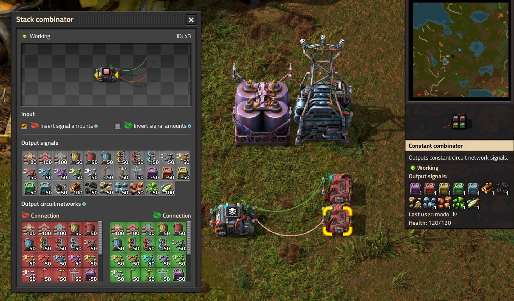
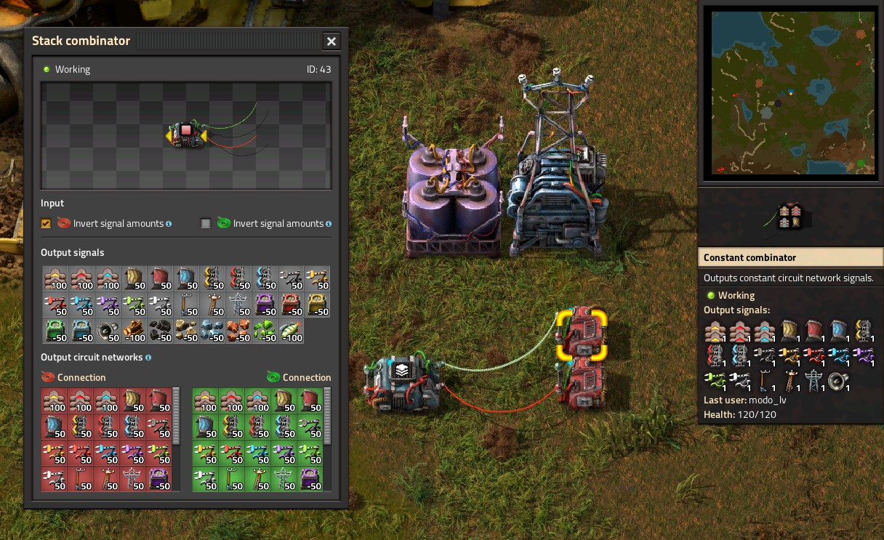

# Stack Combinator

A mod for [Factorio](http://factorio.com) that adds a new type of circuit network combinator to research and craft: a stack combinator. This combinator multiplies each input item signal it receives by that item's stack size. For example, if the stack size for Coal is 50 and you send a Coal signal with value 2, a stack combinator will output Coal×100.

## Features
* **Item signal *stackification***. Each item signal sent to the stack combinator input is output with its amount multiplied by that item's stack size. Non-item signals are output unchanged.
* **Signal inversion**. Each combinator can also be configured to *invert* input signals (green, red or both), which treats positive input signal amounts as negative and vice-versa.
* **Output signal display**. Opening the stack combinator shows all output signals, even if the combinator's output isn't connected to anything. The display includes "raw" output signals — what stack combinator is sending (displayer in silver), and "network" output signals — what the final signals are on the output wire, taking into account any other connected signal sources.

## Compatibility & balancing

* Works with **blueprints**.
* **Shouldn't break anything**. Stack combinator is based on the *arithmetic and constant combinators*, and does not involve any other entities or game objects.
* **Research costs** are calculated dynamically based on *circuit network* technology costs, so it should fit in naturally with balance changes introduced by other mods.
* **Crafting costs** are an *arithmetic combinator* and a *repair pack*.
* Can be **moved around with [Picker Dollies](https://mods.factorio.com/mod/PickerDollies)**.
* **Multiplayer** hasn't been tested, but the mod doesn't do anything incompatible that I know of, so it *should* be OK.
* Takes twice as long to build in **expensive mode**.

## Limitations
* Due to the way game works, the **maximum amount of output signals** is initially limited to 40 (twice the capacity of a vanilla *constant combinator*). You can increase the limit in startup settings, but it may affect performance (according to [Larger Constant Combinator's changelog](https://mods.factorio.com/mod/Larger-Constant-Combinator/changelog); I haven't tested any large amounts myself).
    * If a static combinator receives more signals than it can output, it won't output anything and raise an alert (so you can see on the map which combinator is having the problem and where).

## Discussion & bug reports
* The main dicussion and bug report place is [the mod's **discussion page**](https://mods.factorio.com/mod/stack-combinator/discussion).
* There's also a [thread on the forums](https://forums.factorio.com/viewtopic.php?f=190&t=94655).
* Bugs can be reported directly [on GitHub](http://github.com/modo-lv/factorio-mod-stack-combinator/issues), but other users are less likely to go there.
* A [Discord](https://discord.gg/K3aHYvak9M) exists as well.

## Acknowledgements
* This is my first serious mod ([Declutter](http://mods.factorio.com/mod/declutter) was a trivial couple of lines), and the mod that helped me figure out most of what I needed to get started was **[Filter Combinator](https://mods.factorio.com/mod/Filter_Combinator) by [gcascaes](https://mods.factorio.com/user/gcascaes)**.
* Big thanks to [Picker Dollies](https://mods.factorio.com/mod/PickerDollies) for making it not only possible, but trivially easy to add support for it in other mods.
* I also had a look at:
    * [Larger Constant Combinator](https://mods.factorio.com/mod/Larger-Constant-Combinator) for output signal capacity increase.
    * [Circuit HUD](https://mods.factorio.com/mod/CircuitHUD) for signal display GUI styles.

## Screenshots

